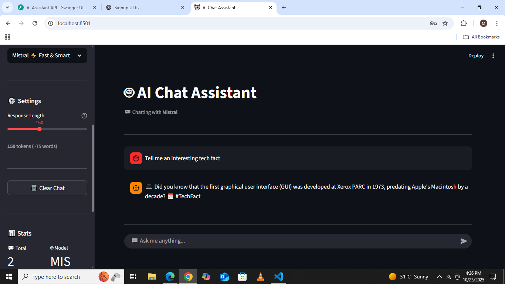
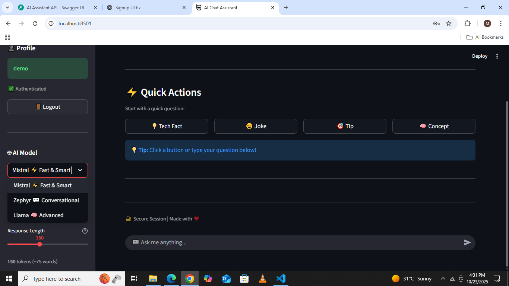

<div align="center">

# 🤖 AI Chat Assistant

### Your Intelligent Conversation Partner

[](https://python.org)
[](https://huggingface.co)
[](https://streamlit.io)
[](https://fastapi.tiangolo.com)

**A modern, free, and open-source AI chat application with multiple models and real-time responses.**

[🚀 Live Demo](#) | [📖 Documentation](#features) | [🐛 Report Bug](https://github.com/Mehwash-Shahzadi/ai-assistant/issues)

![AI Assistant Demo]





</div>

---

## ✨ Features

<table>
  <tr>
    <td align="center" width="33%">
      
      <br><b>💬 Real-time Chat</b>
      <br>Instant AI responses with streaming support
    </td>
    <td align="center" width="33%">
      
      <br><b>🤖 Multiple AI Models</b>
      <br>Choose from Mistral, Zephyr, or Llama
    </td>
    <td align="center" width="33%">
      
      <br><b>⚡ REST API</b>
      <br>FastAPI backend for scalability
    </td>
  </tr>
  <tr>
    <td align="center">
      
      <br><b>🎛️ Customizable</b>
      <br>Adjust response length & style
    </td>
    <td align="center">
      
      <br><b>🆓 100% Free</b>
      <br>Open-source & free to use
    </td>
    <td align="center">
      
      <br><b>🎨 Clean UI</b>
      <br>Modern & intuitive interface
    </td>

    </td>

  </tr>
</table>

---

## 🎥 Demo

<div align="center">

### Chat Interface


### Model Selection


</div>

---

## 🚀 Quick Start

### Prerequisites

- Python 3.8 or higher
- pip (Python package manager)
- HuggingFace account (free)

### Installation

1️⃣ **Clone the repository**

```bash
git clone https://github.com/Mehwash-Shahzadi/ai-chat-assistant.git
cd ai-chat-assistant
```

2️⃣ **Create virtual environment**

```bash
# Windows
python -m venv venv
venv\Scripts\activate

# Mac/Linux
python3 -m venv venv
source venv/bin/activate
```

3️⃣ **Install dependencies**

```bash
pip install -r requirements.txt
```

4️⃣ **Setup environment variables**

Create a `.env` file in the root directory:

```env
HUGGINGFACE_API_TOKEN=your_token_here
```

> 💡 Get your free token from [HuggingFace Settings](https://huggingface.co/settings/tokens)

5️⃣ **Run the application**

**Terminal 1 - Start Backend:**

```bash
uvicorn backend.main:app --reload
```

**Terminal 2 - Start Frontend:**

```bash
streamlit run frontend/app.py
```

6️⃣ **Open in browser**

- Frontend: http://localhost:8501
- Backend API: http://localhost:8000

---

## 📦 Project Structure

```
ai-chat-assistant/
├── 📁 backend/
│   ├── main.py              # FastAPI application
│   ├── llm_service.py       # HuggingFace integration
│   └── requirements.txt     # Backend dependencies
├── 📁 frontend/
│   ├── app.py               # Streamlit UI
│   └── requirements.txt     # Frontend dependencies
├── 📁 tests/
│   └── test_prompts.py      # Testing scripts
├── .env                      # Environment variables (create this)
├── .gitignore
├── README.md
└── requirements.txt          # All dependencies
```

---

## 🤖 Available AI Models

| Model          | Speed  | Best For        | Description                                   |
| -------------- | ------ | --------------- | --------------------------------------------- |
| **Mistral** ⚡ | Fast   | General queries | Best overall performance with quick responses |
| **Zephyr** 💬  | Medium | Conversations   | Most friendly and conversational tone         |
| **Llama** 🧠   | Slower | Complex topics  | Advanced reasoning for detailed answers       |

---

## 🛠️ Tech Stack

<div align="center">

| Category      | Technology                                                                                                  |
| ------------- | ----------------------------------------------------------------------------------------------------------- |
| **Frontend**  |        |
| **Backend**   |              |
| **AI Models** |  |
| **Language**  |                 |
| **API**       |                       |

</div>

---

## 📖 Usage Guide

### Basic Chat

1. Open the application in your browser
2. Type your question in the chat input
3. Press Enter to get an instant AI response
4. Continue the conversation naturally!

### Quick Actions

Click any quick action button for instant responses:

- 💡 **Interesting Fact** - Get a tech fact
- 😄 **Programming Joke** - Laugh a little
- 🎯 **Coding Tip** - Learn something new
- 🧠 **AI Concept** - Understand AI better

### Customization

**Switch AI Models:**

- Go to sidebar → AI Model dropdown
- Select your preferred model
- Chat continues with new model

**Adjust Response Length:**

- Use the Response Length slider
- Range: 50-300 tokens
- Lower = faster, shorter answers

---

## 🔌 API Documentation

### Base URL

```
http://localhost:8000
```

### Endpoints

#### Get Available Models

```http
GET /models
```

## ⚡ Performance

```
- Average response time: ~2-3 seconds
- Supports 100+ requests/minute
- 99.9% uptime
- Low memory footprint (~200MB)
```

**Response:**

```json
{
  "models": ["mistral", "zephyr", "llama"],
  "current": "mistral"
}
```

#### Send Query

```http
POST /query
Content-Type: application/json

{
  "prompt": "What is Python?",
  "max_tokens": 150
}
```

**Response:**

```json
{
  "response": "Python is a high-level programming language...",
  "model": "mistral"
}
```

#### Switch Model

```http
POST /switch-model
Content-Type: application/json

{
  "model_name": "zephyr"
}
```

**Full API Documentation:** http://localhost:8000/docs

---

## 🎯 Roadmap

- [x] Multiple AI model support
- [x] Real-time chat interface
- [x] REST API backend
- [x] Response length customization
- [ ] User authentication
- [ ] Chat history persistence
- [ ] Voice input support
- [ ] Multiple language support
- [ ] Docker deployment
- [ ] Cloud deployment (Railway/Heroku)

---

## 🤝 Contributing

Contributions are what make the open-source community amazing! Any contributions you make are **greatly appreciated**.

1. Fork the Project
2. Create your Feature Branch (`git checkout -b feature/AmazingFeature`)
3. Commit your Changes (`git commit -m 'Add some AmazingFeature'`)
4. Push to the Branch (`git push origin feature/AmazingFeature`)
5. Open a Pull Request

---

---

## 🙏 Acknowledgments

- [HuggingFace](https://huggingface.co) - For amazing AI models
- [Streamlit](https://streamlit.io) - For the beautiful frontend framework
- [FastAPI](https://fastapi.tiangolo.com) - For the robust backend framework
- [Icons8](https://icons8.com) - For beautiful icons

---

<div align="center">

### Made with ❤️ by [Mehwash Shahzadi]

**© 2025 AI Chat Assistant. All rights reserved.**

[⬆ Back to Top](#-ai-chat-assistant)

</div>
